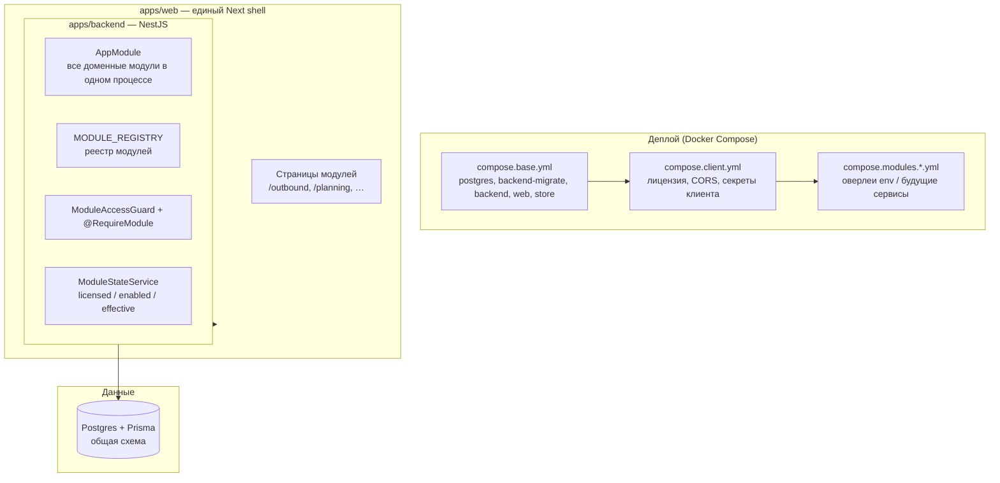

# Структура модульности CRM (текущее состояние и ближайшая эволюция)

Документ описывает, как устроена модульность **сейчас** в коде и в деплое, и куда она движется на первом этапе (core image + module overlays + отдельные backend-процессы позже), без обязательства резать UI на отдельные web images.

## Слои системы

## Идентификаторы модулей (единый контракт)

Строковые ID заданы в `packages/contracts` и реэкспортируются в backend/web:

| ID | Роль в реестре | Примечание |
|----|----------------|------------|
| `core.crm` | core | Базовый CRM, не отключается как «модуль» |
| `ext.voice_outbound` | extension | В реестре: `delivery: external_service` (процесс пока в монолите) |
| `ext.finance` | extension | Платежи, транзакции, разнос |
| `int.privat24` | integration | Выписка Privat24 Autoclient |
| `int.upc` | integration | Open Banking UPC (AIS) |
| `ext.production_planning` | extension | Планирование производства |
| `int.integrations_telegram` | integration | Telegram inbox |
| `int.nova_poshta` | integration | НП, TTN |
| `int.google_sheet` | integration | Экспорт / webhook |
| `int.bitrix` | integration | Синк + webhook |
| `int.ringostat` | integration | Звонки, записи |

Источник правды по списку и метаданным: `apps/backend/src/modules/module-registry.ts`.

## Три оси «включённости» модуля

Для **не-core** модулей эффективная доступность — пересечение:

1. **Licensed** — есть в подписи: файл `license.json` (режим по умолчанию на клиенте) и/или Control Plane (`compose.client.yml` задаёт `LICENSE_MODE`, пути к ключу и токенам).
2. **Enabled** — в CP-only режиме автоматически равно лицензии (`enabled = licensed`; ручного pilot-слоя нет).
3. **Installed (runtime)** — сейчас в `ModuleStateService` фактически означает «модуль есть в `MODULE_REGISTRY`», а не «отдельный контейнер поднят». Планируется уточнение через manifest/health.

**Effective** = licensed ∧ enabled ∧ depsOk ∧ (в перспективе) reachable/installation-capability.

HTTP-доступ к защищённым маршрутам: глобальный guard `ModuleAccessGuard` + декоратор `@RequireModule(ModuleIds.*)` на контроллерах; при `MODULE_GATING_ENABLED !== "true"` гейтинг выключен.

## Backend: как код сопоставлен модулям

- **Один процесс** `AppModule` импортирует все доменные Nest-модули (core + интеграции + outbound + store-контуры и т.д.): `apps/backend/src/app.module.ts`.
- **Граница по HTTP**: часть контроллеров помечена `@RequireModule`; остальные маршруты доступны, если гейтинг выключен или модуль не помечен (зона доработки по плану модульности).
- **Cron / jobs** живут внутри тех же Nest-модулей; отдельного процесса под модуль пока нет (кроме заготовки Docker target `outbound-runner`, пока не отделён от основного runner).

### AppModuleCore vs AppModule (матрица)

| Зона | `AppModuleCore` (`apps/backend/src/app.module.core.ts`) | Только в полном `AppModule` (`apps/backend/src/app.module.ts`) |
|------|----------------------------------------------------------|-------------------------------------------------------------------|
| Auth, users, CRM сущности (contacts, leads, orders, products, companies, …) | ✅ | ✅ |
| Metadata / ops | `custom-fields`, `layouts`, `dictionaries`, `workflows`, `rbac`, `audit`, `data-import`, `custom-entities` | ✅ |
| Финансы / банк / платежи | — | `BankModule`, `PaymentsModule`, `FinanceIdempotencyModule` |
| Интеграции | `IntegrationPortsModule` (порты без тяжёлых адаптеров) | `TelegramModule`, `RingostatModule`, `Bitrix*`, `GoogleSheetModule`, `NpModule` |
| Расширения | `HelpModule`, `RiskModule`, `ReceivablesModule` | `OutboundModule`, `ProductionPlanningModule`, `StoreModule`, `CallsModule`, `ManualCallingModule` |

Образ **`crm-core-api`** собирается с entrypoint `core-main` и импортирует только `AppModuleCore`. CI: workflow **Preflight Release Build** собирает target `core-runner` и валидирует `deployment-manifest.json` через `scripts/validate-deployment-manifest.mjs`; контрактный тест: `apps/backend/src/system/__tests__/deployment-manifest.contract.spec.ts`.

## Web: как UI сопоставлен модулям

- **Один образ** `crm-web`, один Next build.
- **Страницы** по путям приложения (`apps/web/src/app/outbound`, `planning`, `payments`, `inbox`, …).
- **Запросы к API** идут через BFF-слой `apps/web/src/app/api/**` → `proxyToBackend` к единому backend (пример: `apps/web/src/app/api/outbound/campaigns/route.ts`).

Клиентский контекст модулей: `ModulesProvider` / `useModules()` читает `GET /system/modules` и даёт `effective(id)` для UI (при ошибке загрузки — fail-open к `true` для совместимости).

## Деплой: база и оверлеи

| Файл | Назначение |
|------|------------|
| `compose.base.yml` | Postgres, migrate, `backend`, `web`, `store` — образы из registry |
| `compose.client.yml` | Порты, лицензия, NP/SMTP/workflow env и т.д. |
| `compose.modules.outbound.yml` | Env для outbound + часто `MODULE_GATING_ENABLED` |
| `compose.modules.finance.yml` | Активация finance-слоя |
| `compose.modules.integrations.yml` | Интеграции |
| `compose.modules.production-planning.yml` | Производство |

Сборка стека: `docker compose -f compose.base.yml -f compose.client.yml [-f compose.modules.*.yml ...] up`.

Проверка **всех** sidecar-сервисов одной командой (тот же набор файлов + `wget /system/version` внутри контейнеров): `scripts/smoke-sidecar-stack.sh`; статус фаз — `docs/module-split-progress.md`.

## Пакеты SDK / контрактов

- `packages/contracts` — `ModuleIds` и типы для API модулей (в т.ч. ответ `/system/modules`).
- `packages/module-sdk` — `defineModule`, манифест регистрации для реестра.

## План доведения архитектуры

Пошаговый план (фазы, матрица маршрутов, DoD, что не менять): **[`modular-architecture-completion-plan.md`](modular-architecture-completion-plan.md)**.

Кратко: целевой prod = **`crm-core-api` + sidecar**; закрыть разрыв **HTTP proxy** vs **`IntegrationPorts`** (finance, google-sheet); расширить smoke; единый runbook.

## Куда движется первая волна (без нарезки UI)

Кратко, в терминах плана «Core + module images»:

1. **Core entrypoint** — отдельный `AppModuleCore` / образ только с core-модулями; полный `AppModule` остаётся для совместимости или полной сборки.
2. **Manifest + validator** — роли образов (`core`, `module`, `client_extension`), digest, overlays compose.
3. **Первый module process** — отдельный сервис для `ext.voice_outbound` (backend + cron), UI остаётся в `apps/web`; на `crm-core-api` включён reverse-proxy по `OUTBOUND_UPSTREAM_URL` на префиксы `/outbound` и `/integrations/outbound-voice` (один `API_URL` у браузера).
4. **`installed` / `reachable`** — привязка к реально поднятым сервисам и healthcheck, а не только к реестру.

## Краткая матрица «где живёт сейчас»

| Аспект | Сейчас | После первой волны (цель) |
|--------|--------|---------------------------|
| UI модулей | `apps/web` | `apps/web` (без изменения принципа) |
| API модулей | Процесс `backend` | Часть API/cron — отдельные контейнеры |
| БД | Один Postgres, Prisma | По-прежнему общий (переходный режим) |
| Включение модуля | License + enabled + guard | + manifest / сервис в compose |
| Образы | `crm-backend-core`, `crm-web`, `crm-store` | + `crm-module-*`, опционально `crm-client-*` |

## Wave B: Telegram и Outbound

**Решение по умолчанию:** `TelegramModule` **забандлен** в образ `crm-module-outbound` (`OutboundModule` импортирует Telegram). Отдельный `crm-module-telegram` и HTTP-замена прямого импорта — опциональная фаза hardening.

Публичные маршруты `/auth/telegram-*` остаются в **core** (`AuthModule` в `crm-core-api`), не проксируются в outbound worker (см. план split / cookie / issuer).

---

*При расхождении с кодом приоритет у репозитория; этот файл можно обновлять по мере внедрения core-only и отдельных module images.*
