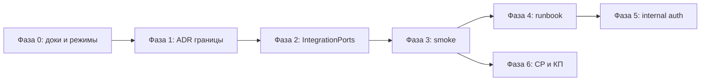

# План: модульная архитектура CRM — довести до «правильно и чётко»

Документ фиксирует **целевое состояние**, **фазы работ**, **критерии готовности** и **что сознательно не делаем**.  
Дополняет `docs/CRM-modularity-structure.md`, `docs/modules-prod-matrix.md`, `docs/module-split-progress.md`.

**Контекст:** сейчас архитектура — **modular monolith с sidecar** (общая БД, один артефакт backend, HTTP-прокси с core). Это **правильный переходный этап**, но есть разрыв между **HTTP-прокси** и **in-process `IntegrationPorts`**.

---

## 1. Цель (Definition of Done)

Система считается «доведённой», когда выполнены все пункты:

| # | Критерий |
|---|----------|
| D1 | **Prod по умолчанию** = `crm-core-api` + sidecar по лицензии; `crm-backend-core` = только монолит / legacy / dev. |
| D2 | Для каждого cross-module вызова задокументировано и протестировано: **core in-process** \| **HTTP proxy** \| **HTTP port-adapter**. Нет silent no-op. |
| D3 | `scripts/smoke-sidecar-stack.sh` покрывает **все 8** module images (включая `kyivstar-fmc`) + сценарные HTTP-проверки, не только `/system/version`. |
| D4 | Операторский runbook: compose, env, cron single-writer, migrate — один источник правды, без противоречий между доками. |
| D5 | CP / онбординг / КП описывают **публикуется в релизе** vs **поднимается на клиенте** vs **in-process only**. |
| D6 | `docs/module-split-progress.md` отражает фазы ниже; закрытые фазы помечены Done. |

**Не цель этого плана:** настоящие микросервисы, отдельные БД, лёгкие образы <500 MB, отдельные web-images по модулям.

---

## 2. Два допустимых режима деплоя (зафиксировать публично)

| Режим | Образ backend | Sidecar | Когда |
|-------|---------------|---------|-------|
| **Монолит** | `crm-backend-core` | нет (`*_UPSTREAM_URL` пусто) | dev, малые инсталляции, миграция «как раньше» |
| **Модульный (целевой prod)** | `crm-core-api` | по лицензии + compose overlays | production, SKU с модулями |

Правило для команды и клиентов: **модульный режим — целевой**; монолит — поддерживаемый, но не рекомендуемый для новых prod.

---

## 3. Матрица владения cross-module вызовами (аудит)

Легенда: ✅ OK в модульном режиме · ⚠️ требует доработки · 🔒 только in-process (sidecar не нужен)

### 3.1 HTTP с браузера / BFF (через core)

| Маршрут (префикс) | Sidecar env | Прокси | Статус |
|-------------------|-------------|--------|--------|
| `/payments`, `/bank`, `/client-balances`, `/payment-requests`, `/public/payment-requests` | `FINANCE_UPSTREAM_URL` | static | ✅ |
| `/orders/:id/payment-requests` | `FINANCE_UPSTREAM_URL` | regex | ⚠️ дубль: `OrdersController` + `PaymentRequestsModule` на core |
| `/orders/:id/payments` | — | **нет** | ⚠️ только `IntegrationPorts` → finance worker |
| `/integrations/privat24`, `/integrations/upc` | `FINANCE_UPSTREAM_URL` | static | ✅ |
| `/np`, `/store/np` | `NP_UPSTREAM_URL` | static | ✅ (`StoreNpController` только в `NpModule`, не в core) |
| `/orders/:id/np/ttn`, `/orders/:id/ttn`, `/shipments/:id/np/ttn` | `NP_UPSTREAM_URL` | regex | ✅ |
| `/integrations/google-sheet` | `GOOGLE_SHEET_UPSTREAM_URL` | static | ✅ |
| `/orders/:id/send-to-sheet`, `/settings/google-sheet` | `GOOGLE_SHEET_UPSTREAM_URL` | regex | ✅ (HTTP); ⚠️ in-process auto-export в `OrdersService` |
| `/outbound`, `/manual-calling`, `/calls`, `/integrations/outbound-voice` | `OUTBOUND_UPSTREAM_URL` | static | ✅ |
| `/planning` | `PLANNING_UPSTREAM_URL` | static | ✅ |
| `/integrations/bitrix` | `BITRIX_UPSTREAM_URL` | static | ✅ |
| `/integrations/ringostat`, `/settings/ringostat` | `RINGOSTAT_UPSTREAM_URL` | regex | ✅ |
| `/integrations/kyivstar-fmc`, `/settings/kyivstar-fmc` | `KYIVSTAR_FMC_UPSTREAM_URL` | regex | ✅ |
| `/integrations/telegram`, `/conversations`, `/settings/telegram` | — | нет | 🔒 core only |
| `/visits`, `/field` | — | нет | 🔒 core only |
| `/settings/store`, store checkout API | — | нет | 🔒 core API; витрина = `crm-store` |

### 3.2 In-process `IntegrationPorts` (core → модуль)

| Вызов | Регистратор адаптера | Процесс с адаптером | Модульный режим |
|-------|----------------------|---------------------|-----------------|
| `listOrderPaymentsByOrderId` | `PaymentsIntegrationAdapter` | finance | ⚠️ |
| `recalcOrderFinance` | `PaymentsIntegrationAdapter` | finance | ⚠️ **silent no-op** на core |
| `settleReturn` / `getReturnSettlementPreview` | `ClientBalancesIntegrationAdapter` | finance | ⚠️ |
| `resolveStoreDefaultBankAccountIdForCheckout` | `BankIntegrationAdapter` | finance | ⚠️ |
| `sendOrderToSheet` | `GoogleSheetIntegrationAdapter` | google-sheet | ⚠️ |
| `searchNpCities/Warehouses/Streets` | `NpIntegrationAdapter` | np | ✅ не нужен на core (`/store/np` проксируется) |
| `sendMessageToChat` | `TelegramIntegrationAdapter` | core (TelegramModule) | 🔒 OK |

**Вывод:** главный технический долг — **finance и google-sheet порты** при sidecar.

---

## 4. Фазы работ

### Фаза 0 — Зафиксировать правила (1 PR, в основном доки)

**Задачи**

- [ ] Обновить `docs/docker-images.md`: 8 module targets, `kyivstar-fmc-runner`, убрать устаревший `-migrate` target; migrate = one-shot из `crm-backend-core` / `crm-core-api`.
- [ ] В `docs/modules-prod-matrix.md`: строка `int.kyivstar_fmc`, cron `KYIVSTAR_FMC_CRON_DISABLED`, таблица Docker target ↔ entrypoint.
- [ ] Добавить в README / `docs/client-onboarding-workflow.md` блок **«Два режима деплоя»** (§2 этого плана).
- [ ] Синхронизировать release notes / КП: «публикуется» vs «в базовом compose» (`crm-store` — overlay).

**DoD:** новый клиент по докам понимает, какой образ backend ставить и что опционально.

---

### Фаза 1 — Единое правило границы core ↔ module (дизайн, 0.5–1 день)

Выбрать и записать в `docs/CRM-modularity-structure.md` **одну** стратегию:

| Стратегия | Суть | Плюсы | Минусы |
|-----------|------|-------|--------|
| **A. Proxy-first** | Все внешние и nested HTTP-маршруты только через `MODULE_UPSTREAM_*`; убрать дублирующие handlers с core | Простая модель для операторов | Нужно вычистить `PaymentRequestsModule` из core paths |
| **B. HTTP port-adapters** | `IntegrationPortsService` при отсутствии in-process адаптера вызывает `{UPSTREAM}/...` с service token | Минимальный diff UI/API | Сложнее тестировать, два пути на вызов |
| **C. Гибрид (рекомендуется)** | Пользовательский HTTP → proxy-first; **внутренние** вызовы core-домена (returns, checkout, pipeline) → HTTP port-adapters | Баланс | Нужен маленький SDK для internal HTTP |

**Рекомендация:** **C (гибрид)**.

**DoD:** ADR-параграф в `CRM-modularity-structure.md`; список файлов на изменение согласован.

---

### Фаза 2 — Закрыть gaps IntegrationPorts (код, 2–4 PR)

Порядок PR (от высокого риска к низкому):

#### PR 2.1 — Finance ports

- [ ] `recalcOrderFinance`: убрать silent no-op → HTTP к finance worker или `ServiceUnavailableException` если upstream недоступен.
- [ ] `listOrderPaymentsByOrderId`: либо regex-прокси `/orders/:id/payments` → finance, либо HTTP port-adapter.
- [ ] `settleReturn` / `getReturnSettlementPreview`: HTTP port-adapter на `/client-balances/...` (уже в finance static proxy).
- [ ] `resolveStoreDefaultBankAccountIdForCheckout`: HTTP к finance (`/bank/...` internal) или тонкий read-only endpoint на finance.

**Тесты:** unit на port-adapter fallback; e2e `crm-core-api` + finance sidecar (mock upstream).

#### PR 2.2 — Google Sheet port

- [ ] `sendOrderToSheet` из `OrdersController` / `OrdersService` (auto-export): HTTP port-adapter или отложенный job только на worker.

#### PR 2.3 — Убрать дубли на core

- [ ] Решить судьбу `PaymentRequestsModule` в `OrdersModule` / `StoreModule`:
  - **вариант 1:** удалить handlers с core, оставить только regex proxy на finance;
  - **вариант 2:** оставить на core, убрать regex proxy (finance только по прямым префиксам).
- [ ] Зафиксировать выбор в матрице §3.1.

**DoD PR 2:** матрица §3.2 — все ⚠️ → ✅ или явно 🔒 с тестом.

---

### Фаза 3 — Smoke и контрактные тесты (1–2 PR)

- [ ] `scripts/smoke-sidecar-stack.sh`: добавить `compose.modules.kyivstar-fmc-sidecar.yml` и сервис `backend-kyivstar-fmc`.
- [ ] Новый `scripts/smoke-sidecar-routes.sh` (или режим `smoke routes`):
  - finance: `GET /orders/{id}/payments`, settlement preview return;
  - np: `GET /store/np/cities?q=...`;
  - google-sheet: `POST /orders/{id}/send-to-sheet` (stub);
  - cron flags: проверка env в merged compose config.
- [ ] Контрактный тест: `core + FINANCE_UPSTREAM_URL` → `IntegrationPorts` не no-op (jest/supertest).
- [ ] Обновить `docs/hardening-smoke-checklist.md`.

**DoD:** CI или pre-release manual gate: `smoke-sidecar-stack.sh smoke` + route smoke зелёные.

---

### Фаза 4 — Операторский runbook (1 PR, доки)

Единый чеклист (можно `docs/sidecar-prod-runbook.md`):

```text
Перед up:
  □ backend-migrate (тот же BACKEND_VERSION)
  □ BACKEND_IMAGE_NAME=crm-core-api
  □ для каждого sidecar: *_UPSTREAM_URL на backend
  □ на backend: *_CRON_DISABLED=true (включая KYIVSTAR_FMC_CRON_DISABLED)
  □ на worker: CRON_ENABLED=true
  □ NP_WRITES_DISABLED=true на core при backend-np
  □ compose files = пересечение лицензии CP и SKU

После up:
  □ GET /system/modules — effective=true для лицензированных
  □ /settings/health — upstream OK
  □ smoke routes (фаза 3)
```

Ссылка из `docs/suprex-post-update-checklist.md`, `docs/client-onboarding-workflow.md`, `docs/operator-update-runbook.md`.

**DoD:** один runbook, остальные доки ссылаются, без дублирования противоречий.

---

### Фаза 5 — Безопасность границы core ↔ worker (опционально, 1 PR)

- [ ] Проверка `x-crm-module-internal` на `*-main.ts` workers (сейчас только исходящий заголовок с core).
- [ ] Документировать: JWT пользователя остаётся основным; internal secret — defense in depth.

**DoD:** без секрета worker не принимает прокси-трафик (или soft-fail с логом за feature flag).

---

### Фаза 6 — CP, манифест, КП (1 PR)

- [ ] Манифест: роль `crm-core-api` vs `backend_core` — когда что рекомендовать в CP UI.
- [ ] `docs/commercial-proposal-uk.md`: модули = лицензия + compose; не обещать микросервисную изоляцию данных.
- [ ] SKU-матрица: `int.privat24` / `int.upc` зависят от `ext.finance`; `ext.manual_calling` / `ext.voice_outbound` → один outbound sidecar.

**DoD:** коммерческое описание совпадает с технической матрицей.

---

## 5. Что сознательно НЕ менять

| Не трогать | Почему |
|------------|--------|
| Общая Postgres + Prisma | Осознанный transitional mode |
| 8 образов `crm-module-*` | Покрывают все Dockerfile targets; лицензирование уже завязано |
| Telegram / visits in-process | Нет выгоды от sidecar сейчас |
| Один `crm-web` | Правильно для продукта |
| `gateway-service` / `sip-adapter` в CRM-релизе | Отдельный voice stack, не путать с `int.kyivstar_fmc` |
| Уменьшение размера образов | Отдельный проект (multi-stage / prune), не блокер модульности |

---

## 6. Оценка сроков (ориентир)

| Фаза | Объём |
|------|-------|
| 0 — доки | 0.5–1 дн |
| 1 — ADR / стратегия | 0.5 дн |
| 2 — IntegrationPorts + дубли | 3–5 дн |
| 3 — smoke / тесты | 1–2 дн |
| 4 — runbook | 0.5–1 дн |
| 5 — internal auth (опц.) | 1–2 дн |
| 6 — CP / КП | 0.5–1 дн |

**Минимум до «можно обещать core+sidecar без монолита»:** фазы 0–3.  
**Полный DoD (§1):** фазы 0–6.

---

## 7. Порядок выполнения (кратко)



---

## 8. Трекинг

Обновлять статус в `docs/module-split-progress.md`:

| Фаза | Статус | PR / примечание |
|------|--------|-----------------|
| 0 — Документация | Pending | |
| 1 — ADR границы | Pending | |
| 2 — IntegrationPorts | Pending | |
| 3 — Smoke | Pending | kyivstar в smoke-sidecar-stack |
| 4 — Runbook | Pending | |
| 5 — Internal auth | Pending | опционально |
| 6 — CP / КП | Pending | |

---

*При расхождении с кодом приоритет у репозитория; этот план — источник «что доделать», не описание текущего идеала.*
